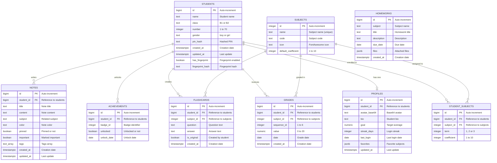

# SMART GRADE - Database Schema

```mermaid
erDiagram
    STUDENTS ||--o| PROFILES : "has one"
    STUDENTS ||--o{ STUDENT_SUBJECTS : "enrolled in"
    STUDENTS ||--o{ GRADES : "receives"
    STUDENTS ||--o{ ACHIEVEMENTS : "unlocks"
    STUDENTS ||--o{ FLASHCARDS : "creates"
    STUDENTS ||--o{ NOTES : "writes"
    SUBJECTS ||--o{ STUDENT_SUBJECTS : "assigned to"
    SUBJECTS ||--o{ GRADES : "graded in"
    SUBJECTS ||--o{ FLASHCARDS : "categorized as"

    STUDENTS {
        bigint id PK "Auto-increment"
        text name "Student name"
        text class "B1 or B2"
        integer number "1 to 70"
        text gender "boy or girl"
        text pin_hash "Hashed PIN"
        timestamptz created_at "Creation date"
        timestamptz updated_at "Last update"
        boolean has_fingerprint "Fingerprint enabled"
        text fingerprint_hash "Fingerprint hash"
    }

    PROFILES {
        bigint id PK "Auto-increment"
        bigint student_id FK "Reference to students"
        text avatar_base64 "Base64 avatar"
        text bio "Student bio"
        numeric goal "Target average"
        integer streak_days "Login streak"
        date last_login "Last login date"
        jsonb favorites "Favorite subjects"
        timestamptz updated_at "Last update"
    }

    SUBJECTS {
        integer id PK "Auto-increment"
        text name "Subject name (unique)"
        text code "Subject code"
        text icon "FontAwesome icon"
        integer default_coefficient "1 to 10"
    }

    STUDENT_SUBJECTS {
        bigint id PK "Auto-increment"
        bigint student_id FK "Reference to students"
        integer subject_id FK "Reference to subjects"
        integer term "1, 2 or 3"
        integer coefficient "1 to 10"
    }

    GRADES {
        bigint id PK "Auto-increment"
        bigint student_id FK "Reference to students"
        integer subject_id FK "Reference to subjects"
        integer sequence_id "1 to 6"
        numeric value "0 to 20"
        date date "Grade date"
        timestamptz created_at "Creation date"
    }

    ACHIEVEMENTS {
        bigint id PK "Auto-increment"
        bigint student_id FK "Reference to students"
        integer badge_id "Badge identifier"
        boolean unlocked "Unlocked or not"
        date unlock_date "Unlock date"
    }

    FLASHCARDS {
        bigint id PK "Auto-increment"
        bigint student_id FK "Reference to students"
        integer subject_id FK "Reference to subjects"
        text question "Question text"
        text answer "Answer text"
        boolean is_original "Created by student"
        timestamptz created_at "Creation date"
    }

    NOTES {
        bigint id PK "Auto-increment"
        bigint student_id FK "Reference to students"
        text title "Note title"
        text content "Note content"
        text subject "Related subject"
        text color "Note color"
        boolean pinned "Pinned or not"
        boolean important "Marked important"
        text_array tags "Tags array"
        timestamptz created_at "Creation date"
        timestamptz updated_at "Last update"
    }

    HOMEWORKS {
        bigint id PK "Auto-increment"
        text subject "Subject name"
        text title "Homework title"
        text description "Description"
        date due_date "Due date"
        jsonb files "Attached files"
        timestamptz created_at "Creation date"
    }
```
