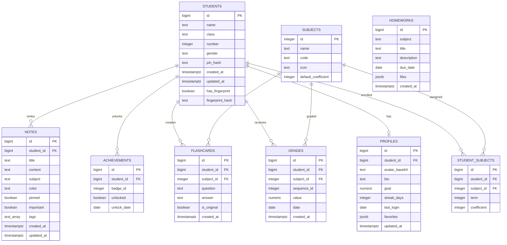

# SMART GRADE - Database Documentation

Complete documentation for the SMART GRADE database, built on Supabase (PostgreSQL).

---

## Table of Contents

1. [Overview](#overview)
2. [File Structure](#file-structure)
3. [Setup Instructions](#setup-instructions)
4. [Database Schema](#database-schema)
5. [Tables Reference](#tables-reference)
6. [Relationships](#relationships)
7. [Security (RLS)](#security-rls)
8. [Performance](#performance)
9. [Triggers](#triggers)
10. [Maintenance](#maintenance)

---

## Overview

| Attribute | Value |
| :--- | :--- |
| **Project** | SMART GRADE |
| **Database Engine** | PostgreSQL 15+ |
| **Hosting** | Supabase |
| **Total Tables** | 9 |
| **Security Model** | Row Level Security (RLS) |
| **Access Control** | Header-based (`x-student-id`) |

The SMART GRADE database is designed to manage student grades, profiles, subjects, notes, flashcards, and achievements for an academic application. All tables are secured with Row Level Security to ensure data privacy.

---

## File Structure

The database is organized into 6 files located in the `database/` folder:

| File | Description |
| :--- | :--- |
| `Database.md` | This documentation file |
| `01_sequences.sql` | Auto-increment sequences for all tables |
| `02_tables.sql` | Table structure with columns, types, and constraints |
| `03_indexes.sql` | Performance indexes on frequently queried columns |
| `04_rls_policies.sql` | Row Level Security policies for all tables |
| `05_triggers.sql` | Automatic timestamp update triggers |

---

## Setup Instructions

To recreate the database on a new Supabase project:

1. Create a new project on [Supabase](https://supabase.com).
2. Navigate to **SQL Editor** in the Supabase dashboard.
3. Execute the files **in the following order**:
   - `01_sequences.sql`
   - `02_tables.sql`
   - `03_indexes.sql`
   - `04_rls_policies.sql`
   - `05_triggers.sql`
4. Verify the installation in **Table Editor**.

> **Important:** The order matters. Sequences must exist before tables, tables before indexes, and tables before policies.

---

## Database Schema

### Entity-Relationship Diagram

### Table Overview

| # | Table | Purpose | Rows Type |
| :--- | :--- | :--- | :--- |
| 1 | `students` | Student accounts and authentication | Master |
| 2 | `profiles` | Student profile information | Detail |
| 3 | `subjects` | Available academic subjects | Reference |
| 4 | `student_subjects` | Enrollment with coefficients | Link |
| 5 | `grades` | Student grades per sequence | Transaction |
| 6 | `achievements` | Unlocked badges | Transaction |
| 7 | `flashcards` | Study flashcards | Transaction |
| 8 | `notes` | Personal notes | Transaction |
| 9 | `homeworks` | Global homework assignments | Reference |

---

## Tables Reference

### 1. students

Stores student accounts and authentication information.

| Column | Type | Constraints | Default |
| :--- | :--- | :--- | :--- |
| `id` | bigint | Primary Key | Auto-increment |
| `name` | text | NOT NULL | - |
| `class` | text | NOT NULL, CHECK (B1, B2) | - |
| `number` | integer | NOT NULL, CHECK (1-70) | - |
| `gender` | text | NOT NULL, CHECK (boy, girl) | 'boy' |
| `pin_hash` | text | NOT NULL | - |
| `created_at` | timestamptz | - | `now()` |
| `updated_at` | timestamptz | - | `now()` |
| `has_fingerprint` | boolean | - | `false` |
| `fingerprint_hash` | text | - | - |

### 2. profiles

Stores additional profile information for each student.

| Column | Type | Constraints | Default |
| :--- | :--- | :--- | :--- |
| `id` | bigint | Primary Key | Auto-increment |
| `student_id` | bigint | Foreign Key, UNIQUE | - |
| `avatar_base64` | text | - | `''` |
| `bio` | text | - | `''` |
| `goal` | numeric | - | `12` |
| `streak_days` | integer | - | `0` |
| `last_login` | date | - | - |
| `favorites` | jsonb | - | `'[]'` |
| `updated_at` | timestamptz | - | `now()` |

### 3. subjects

Stores the list of academic subjects.

| Column | Type | Constraints | Default |
| :--- | :--- | :--- | :--- |
| `id` | integer | Primary Key | Auto-increment |
| `name` | text | NOT NULL, UNIQUE | - |
| `code` | text | NOT NULL | - |
| `icon` | text | - | `'fa-book'` |
| `default_coefficient` | integer | CHECK (1-10) | `5` |

### 4. student_subjects

Links students to subjects with coefficients per term.

| Column | Type | Constraints | Default |
| :--- | :--- | :--- | :--- |
| `id` | bigint | Primary Key | Auto-increment |
| `student_id` | bigint | Foreign Key | - |
| `subject_id` | integer | Foreign Key | - |
| `term` | integer | NOT NULL, CHECK (1-3) | - |
| `coefficient` | integer | CHECK (1-10) | `5` |

### 5. grades

Stores student grades per subject and sequence.

| Column | Type | Constraints | Default |
| :--- | :--- | :--- | :--- |
| `id` | bigint | Primary Key | Auto-increment |
| `student_id` | bigint | Foreign Key | - |
| `subject_id` | integer | Foreign Key | - |
| `sequence_id` | integer | NOT NULL, CHECK (1-6) | - |
| `value` | numeric | NOT NULL, CHECK (0-20) | - |
| `date` | date | - | `CURRENT_DATE` |
| `created_at` | timestamptz | - | `now()` |

### 6. achievements

Stores unlocked badges and achievements.

| Column | Type | Constraints | Default |
| :--- | :--- | :--- | :--- |
| `id` | bigint | Primary Key | Auto-increment |
| `student_id` | bigint | Foreign Key | - |
| `badge_id` | integer | NOT NULL | - |
| `unlocked` | boolean | - | `true` |
| `unlock_date` | date | - | `CURRENT_DATE` |

### 7. flashcards

Stores study flashcards created by students.

| Column | Type | Constraints | Default |
| :--- | :--- | :--- | :--- |
| `id` | bigint | Primary Key | Auto-increment |
| `student_id` | bigint | Foreign Key | - |
| `subject_id` | integer | Foreign Key | - |
| `question` | text | NOT NULL | - |
| `answer` | text | NOT NULL | - |
| `is_original` | boolean | - | `false` |
| `created_at` | timestamptz | - | `now()` |

### 8. notes

Stores personal notes written by students.

| Column | Type | Constraints | Default |
| :--- | :--- | :--- | :--- |
| `id` | bigint | Primary Key | Auto-increment |
| `student_id` | bigint | Foreign Key | - |
| `title` | text | - | `'Untitled'` |
| `content` | text | - | `''` |
| `subject` | text | - | `'General'` |
| `color` | text | - | `'#3498db'` |
| `pinned` | boolean | - | `false` |
| `important` | boolean | - | `false` |
| `tags` | text[] | - | `'{}'` |
| `created_at` | timestamptz | - | `now()` |
| `updated_at` | timestamptz | - | `now()` |

### 9. homeworks

Stores global homework assignments.

| Column | Type | Constraints | Default |
| :--- | :--- | :--- | :--- |
| `id` | bigint | Primary Key | Auto-increment |
| `subject` | text | NOT NULL | - |
| `title` | text | NOT NULL | - |
| `description` | text | - | `''` |
| `due_date` | date | - | - |
| `files` | jsonb | - | `'[]'` |
| `created_at` | timestamptz | - | `now()` |

---

## Relationships

| Source | Target | Type | Description |
| :--- | :--- | :--- | :--- |
| `students` | `profiles` | One-to-One | Each student has one profile |
| `students` | `student_subjects` | One-to-Many | A student has many subject enrollments |
| `students` | `grades` | One-to-Many | A student receives many grades |
| `students` | `achievements` | One-to-Many | A student unlocks many achievements |
| `students` | `flashcards` | One-to-Many | A student creates many flashcards |
| `students` | `notes` | One-to-Many | A student writes many notes |
| `subjects` | `student_subjects` | One-to-Many | A subject is assigned to many students |
| `subjects` | `grades` | One-to-Many | A subject has many grades |
| `subjects` | `flashcards` | One-to-Many | A subject has many flashcards |

**Cascade Behavior:** All foreign keys use `ON DELETE CASCADE`. Deleting a student automatically deletes their profile, grades, achievements, flashcards, notes, and enrollments.

---

## Security (RLS)

### Enabled On All Tables

| Table | RLS Enabled | Public Read | Write Access |
| :--- | :--- | :--- | :--- |
| `students` | Yes | No | Own only |
| `profiles` | Yes | No | Own only |
| `subjects` | Yes | Yes | No |
| `student_subjects` | Yes | No | Own only |
| `grades` | Yes | No | Own only |
| `achievements` | Yes | No | Own only |
| `flashcards` | Yes | No | Own only |
| `notes` | Yes | No | Own only |
| `homeworks` | Yes | Yes | No |

### Access Control

- Each student can only **read, insert, update, and delete their own data**.
- Access is verified via the header `x-student-id` sent in each request.
- The `subjects` and `homeworks` tables are **publicly readable**.
- The role `anon` has **no write permissions** on any table.

---

## Performance

### Indexes

| Table | Indexed Columns |
| :--- | :--- |
| `students` | `class`, `number`, `name` |
| `profiles` | `student_id` |
| `subjects` | `name` |
| `student_subjects` | `student_id`, `subject_id`, `term` |
| `grades` | `student_id`, `subject_id`, `sequence_id`, `date` |
| `achievements` | `student_id`, `badge_id` |
| `flashcards` | `student_id`, `subject_id` |
| `notes` | `student_id`, `pinned`, `important` |
| `homeworks` | `subject`, `due_date` |

---

## Triggers

Automatic timestamp updates on `updated_at` columns.

| Table | Trigger | Action |
| :--- | :--- | :--- |
| `students` | `update_students_updated_at` | Updates `updated_at` on UPDATE |
| `profiles` | `update_profiles_updated_at` | Updates `updated_at` on UPDATE |
| `notes` | `update_notes_updated_at` | Updates `updated_at` on UPDATE |

---

## Maintenance

### Backup Recommendations

- Export your database regularly using `pg_dump` or Supabase backups (Pro plan).
- Keep a copy of the 5 SQL files in a version-controlled repository (GitHub).
- Never commit real student data to GitHub.

### Update Procedures

1. To add a new column, create a new migration file.
2. To modify a policy, use `ALTER POLICY` or drop and recreate.
3. Always test changes on a development project before applying to production.

### Monitoring

- Check the Supabase **Logs** section for slow queries.
- Monitor the **Database** section for storage usage.
- Review RLS policies periodically to ensure they match your security requirements.

---

**End of documentation.**
